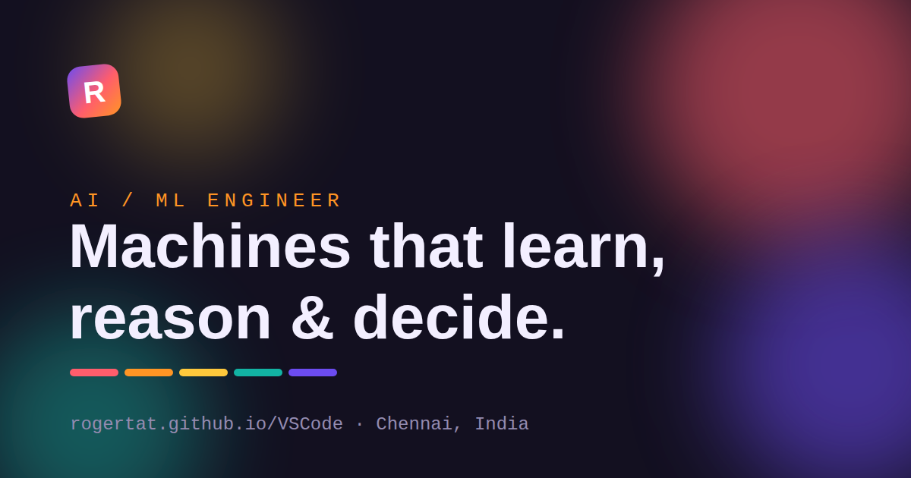

<div align="center">

# Roger — AI/ML Engineer · Portfolio

**A bold, colorful, dependency-free personal portfolio.**
Plain HTML, CSS, and vanilla JavaScript — no framework, no build step.

### → [**View it live: rogertat.github.io/VSCode**](https://rogertat.github.io/VSCode/) ←

[](https://rogertat.github.io/VSCode/)


[](LICENSE)

<br/>



</div>

---

## ✨ Highlights

- **Live neural-net hero** — a canvas of neurons that drift, form synapses, follow your cursor, and fire when clicked.
- **Expressive "Spectrum" design** — a vibrant six-colour palette with the Bricolage Grotesque display face, a highlighter-marker headline, drifting colour blobs, and a scrolling tech marquee.
- **Light & dark themes** — system-aware and remembered between visits.
- **"Voices in my training data"** — AI legends (Karpathy, Amodei, Ng, Musk, Hinton, Fei-Fei Li) rendered as dataset records.
- **`roger-oracle`** — a tiny fake-inference terminal that predicts whether you should reach out, plus an ASCII greeting in the browser console.
- **Accessible & fast** — semantic HTML, keyboard-friendly, WCAG-minded contrast, honors `prefers-reduced-motion`, no libraries or trackers.
- **Print-to-résumé** — the "Résumé" button prints a clean one-page version.

## 🛠 Built with

| | |
|---|---|
| **Markup** | Semantic HTML5 |
| **Styling** | Modern CSS — custom properties, grid/flex, `color-mix()`, container-safe layout |
| **Behaviour** | Vanilla JS (Canvas, IntersectionObserver) — progressive enhancement, works without JS |
| **Type** | Bricolage Grotesque · Hanken Grotesk · Space Mono |
| **Hosting** | GitHub Pages (auto-deployed from `main` via GitHub Actions) |

## 📁 Structure

```
.
├── index.html      # all content and sections
├── styles.css      # design tokens, light/dark themes, print styles
├── script.js       # theme, mobile nav, reveals, neural canvas, oracle
├── assets/         # favicon + social share image
└── .github/workflows/pages.yml   # auto-deploy to GitHub Pages
```

## 🚀 Run locally

It's a static site — open `index.html`, or serve it:

```bash
python3 -m http.server 8000   # then visit http://localhost:8000
```

## 📦 Deploy

Every push to `main` triggers `.github/workflows/pages.yml`, which publishes the
site to the `gh-pages` branch that GitHub Pages serves. No manual steps.

## 🎨 Make it your own

Content is marked with `EDIT:` comments in `index.html`; colours and fonts are
tokens (`--c1`…`--c6`, `--font-*`) at the top of `styles.css`.

## 📫 Contact

Email · Phone · WhatsApp · [GitHub](https://github.com/Rogertat) · [LinkedIn](https://www.linkedin.com/in/roger-a-741a86173/) — all on the [live site](https://rogertat.github.io/VSCode/#contact).

## 📄 License

[MIT](LICENSE) — the template is free to reuse; the content is Roger's.
