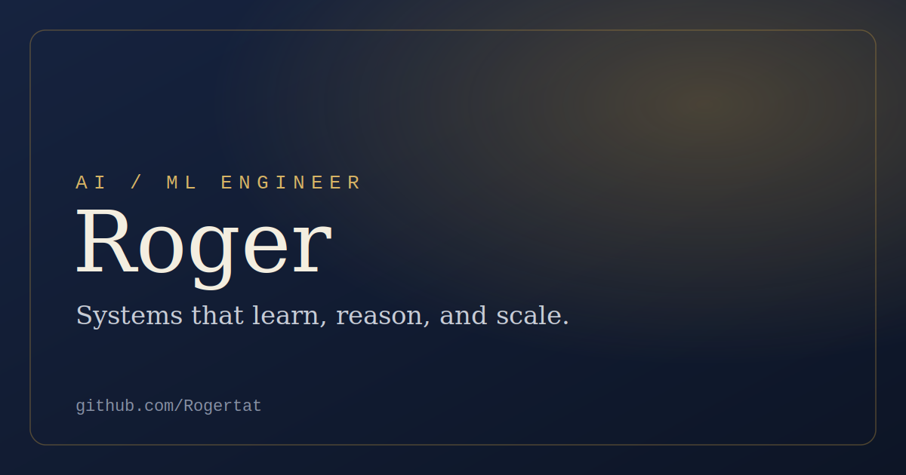

# Roger — Portfolio

A personal portfolio site for **Roger, AI/ML Engineer**. Elegant, responsive,
accessible, and dependency-free — plain HTML, CSS, and a little vanilla
JavaScript. No build step, no framework.

> **Live site:** _add your GitHub Pages or custom-domain URL here once deployed._

<p align="center">
  
</p>

## Features

- **Elegant Professional** design — serif display type (Fraunces) with a muted
  navy-and-gold palette.
- **Light & dark mode** — respects the system preference and remembers your
  choice.
- **Fully responsive**, with a mobile drawer navigation.
- **Accessible** — semantic HTML, skip link, keyboard-friendly, visible focus
  states, and honors `prefers-reduced-motion`.
- **Print-to-résumé** — the "Résumé" button opens a clean, one-page printable
  version of the site.
- **Fast** — no libraries or trackers; fonts degrade gracefully to system fonts
  offline.

## Project structure

```
portfolio/
├── index.html        # All content and sections
├── styles.css        # Design tokens + light/dark themes + print styles
├── script.js         # Theme toggle, mobile nav, scroll reveal, scroll-spy
├── assets/
│   ├── favicon.svg   # "R" monogram
│   └── og-image.svg  # Social share preview
└── README.md
```

## Make it yours

Everything you'll likely want to change is marked with `EDIT:` comments in
`index.html`. The essentials:

1. **Bio & headline** — the hero and *About* section.
2. **Skills** — edit the tag lists in the *Skills* section.
3. **Projects** — replace the four sample projects with your own, and point the
   *Case study* / *Code* links at real URLs.
4. **Experience** — update roles, companies, and dates in the timeline.
5. **Contact & socials** — confirm the email (`roger29995@gmail.com`) and the
   GitHub / LinkedIn links in the *Contact* section and footer.
6. **Meta tags** — update the `<title>`, description, and Open Graph URL/image
   at the top of `index.html` once you know your deployed URL.

Tweak colors and fonts in one place: the `:root` (and `[data-theme="dark"]`)
token blocks at the top of `styles.css`.

## Run locally

It's a static site, so just open `index.html` — or serve it for correct
routing and font loading:

```bash
# Python
python3 -m http.server 8000

# or Node
npx serve .
```

Then visit <http://localhost:8000>.

## Deploy

### GitHub Pages
1. Push this folder to a repository.
2. In **Settings → Pages**, set **Source = Deploy from a branch**, choose your
   branch and the folder containing `index.html`, and save.
3. Your site publishes at `https://<username>.github.io/<repo>/`.

> **Note:** GitHub Pages on a **private** repository requires a paid GitHub plan
> (Pro/Team/Enterprise). If you want free hosting, either make the repo public
> or deploy to a static host below.

### Other one-click static hosts
- **Netlify** or **Vercel** — drag-and-drop the folder or connect the repo.
- **Cloudflare Pages** — connect the repo, no build command needed.

## License

Released under the [MIT License](LICENSE). The content (bio, projects) is yours;
the template is free to reuse.
